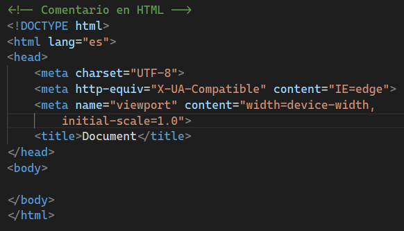

# ¿Cómo empezar con HTML?

[Página de referencia](https://en.wikipedia.org/wiki/HTML_element)

# Etiquetas

## Etiquetas estructurales

* `<html>`: La raíz del elemento HTML. Contiene todos los elementos.
* `<head>`: Contiene metadatos sobre el documento, como el título, el autor, los distitnos tipos de enlaces con otros ficheros, etc.
* `<body>`: Tiene el contenido del documento, como texto, imágenes, enlaces, etc.

### Etiquetas básicas del Head

* `<title>`: Contiene el título del documento.
* `<link>`: Enlaza con un fichero externo, como un CSS o un JS.
* `<meta>`: Contiene metadatos sobre el documento, como el autor, la descripción, etc.
* `<style>`: Contiene estilos CSS.
* `<script>`: Contiene código JavaScript.

### Propuesta 1 - Generar un fichero HTML básico con título.

1. Crear un fichero HTML con el nombre `index.html`.
2. Para obetener el código base de HTML usando VSCode, escribir `html:5` y pulsar `Enter`.
3. Para ejecutar el fichero HTML, pulsar `Ctrl + Shift + P` y escribir `Live Server: Open with Live Server`.
4. A continuación, clicaremos sobre el fichero `index.html` y le daremos a `Open with Live Server`.
   

## Etiquetas básicas del Body

Dentro de todas las etiquetas que pueden existir, las más útiles son las siguientes:

### Estructuras básicas

* `<header>`: Contiene el encabezado del documento.
* `<nav>`: Contiene enlaces de navegación.
* `<main>`: Contiene el contenido principal del documento.
* `<section>`: Contiene el apartado principal del documento.
* `<article>`: Contiene los distintos datos del documento.
* `<aside>`: Contiene información adicional del documento.
* `<footer>`: Contiene el pie de página del documento.

### Componentes básicos

* Encabezados, van del 1 al 6, siendo el 1 el más grande y el 6 el más pequeño.
  * `<h1>`: Encabezado 1
  * `<h2>`: Encabezado 2
  * `<h3>`: Encabezado 3
  * `<h4>`: Encabezado 4
  * `<h5>`: Encabezado 5
  * `<h6>`: Encabezado 6
* `
`: Párrafo
* ` `: Salto de línea
* `
`: Línea horizontal
* `<a>`: Enlace
* ``: Imagen
* `<form>`: Formulario [Apartado de formularios](#formularios)
  * `<input>`: Herramienta básica para la obtención de datos.
  * `<label>`: Etiqueta que asigna un elemento de entrada a un texto.
  * `<textarea>`: Área de texto, hecha para insertar textos o párrafos largos.
  * `<select>`: Contiene distintas opciones (`<option>`)

### Listas

* `<ul>`: Lista no ordenada.
* `<ol>`: Lista ordenada.

Dentro de cada lista se coloca `<li>` para cada elemento de la lista.

### Tablas

Estructura básica de la tabla:

* `<table>`: Base para crear una tabla.
* `<thead>`: Cabecera de la tabla.
* `<tbody>`: Cuerpo de la tabla.
* `<tfoot>`: Pie de la tabla.

Elementos que puede contener una tabla:

* `<tr>`: Fila.
* `<th>`: Celda en negrita.
* `<td>`: Celda.
* `<caption>`: Título.

# Formularios

[Página de referencia](https://www.uv.es/~sto/libros/cyberdisk/alice/html/s1_6.htm)

`<form action="func_pertinente">`

`<input>`: Herramienta básica para la obtención de datos.

* `<input type="text">` : Texto plano
* `<input type="password">` : Texto escondido con caracteres circulares
* `<input type="checkbox">` : Checkbox
  * [ ] Algo así
* `<input type="radio">` : Texto plano
* `<input type="text">` : Texto plano
* `<input type="text">` : Texto plano
* `<input type="text">` : Texto plano
* `<input type="text">` : Texto plano
* `<input type="submit">` : Envía la información recogida en el formulario

`<label>`: Etiqueta que asigna un elemento de entrada a un texto.

`<textarea>`: Área de texto, hecha para insertar textos o párrafos largos.

`<select>`: Contiene distintas opciones (`<option>`)
