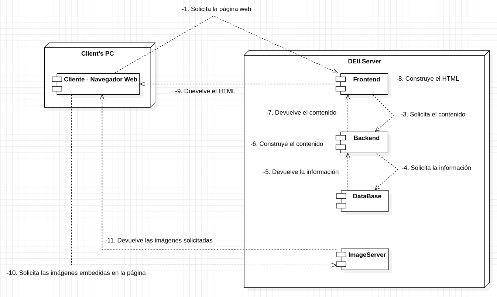
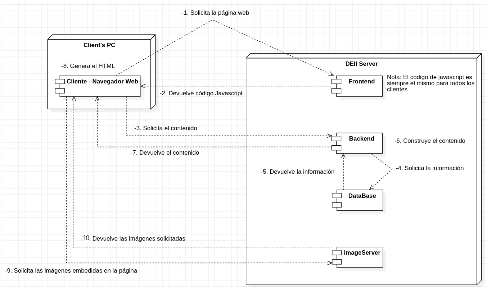
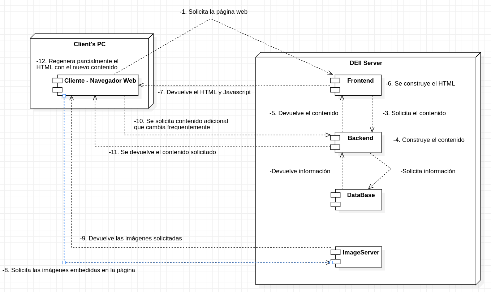
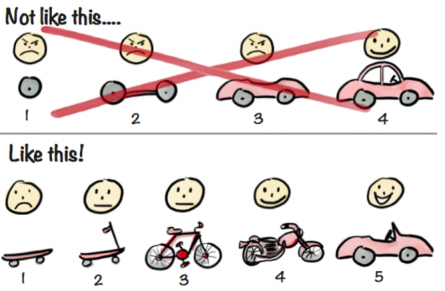
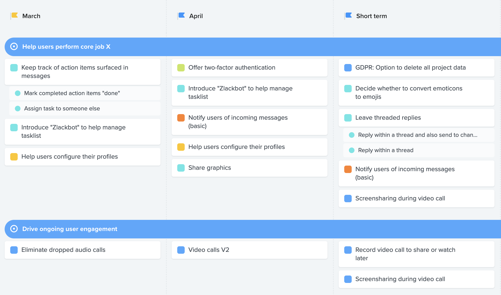
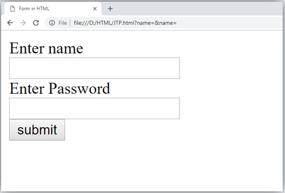

# La guía del desarrollador web galáctico 🚀

Bienvenidos a la guía definitiva de la DEII para entender de una vez por todas el mapa general del desarrollo web. Pero no cualquier desarrollo web, sino el desarrollo web **GALÁCTICO.**

Pero tranquilo astronauta, sabemos que no quieres marearte en tu primer viaje a si que vamos a ir, como dice fonsi, des pa ci to.

el único objetivo de esta guía es que cuando la termines tengas un mapa en la cabeza de como funciona el desarrollo web y puedas comenzar a trabajar.

Comencemos pues!

# Índice

1. [Infraestructura: El mapa](#infraestructura-el-mapa)
2. [Producto: Del problema a la solución](#producto-del-problema-a-la-solución)
3. [Frontend: Del prototipo a una aplicación real](#frontend-del-prototípo-a-una-aplicación-real)
4. [Backend: Dónde ocurre la magia](#backend-dónde-ocurre-la-magia)
5. [Sistemas: Linux uwu](#sistemas-linux-uwu)

<br>

# Infraestructura: El mapa

Buenas aspirante. Antes de poder embarcarte en tu viaje a través de la galaxia para
convertirte en el desarrollador web definitivo vas a tener que familiarizarte con los
protocolos de seguridad de la nave ¿No pensarías que puedes subirte a una nave espacial
sin tener ni pajorera idea, no?

A continuación vamos a atravesar una nebulosa conceptual que describe el desarrollo web
desde el comienzo a hasta las técnicas modernas y que se utilizarán para desarrollar la página web de la delegación.

## El modelo cliente/servidor

<br>

La forma más básica de realizar cualquier tipo de comunicación en internet es
siguiendo el modelo cliente/servidor. En primer lugar, el **cliente** realiza una
petición y, posteriormente, el **servidor** le responde.

```
Cliente               Servidor
   |     Solicitud       |
   | ----------------->  |
   |                     |
   |     Respuesta       |
   | <-----------------  |
```

El punto a recordar es que la interacción siempre la inicia el cliente mientras que
el servidor espera pacientemente una solicitud.

## HTTP

Ahora que hemos hablado de la principal forma en que dos máquinas se envían mensajes
deberíamos hablar del formato de estos.

El protocolo [HTTP](https://en.wikipedia.org/wiki/Hypertext_Transfer_Protocol) es,
de forma muy reducida, el formato con el que se envían todos los mensajes a través de
internet. Ejemplos del uso de HTTP son envíar un formulario de inicio de sesión o el código fuente de una página web (HTML, del que hablaremos más adelante).

Un mensaje HTTP está formado por dos partes.

- **La cabecera del mensaje** contiene metadatos como el
  [tipo de mensaje](https://en.wikipedia.org/wiki/Hypertext_Transfer_Protocol#Request_methods)
  o el formato de los datos enviados (JSON, CSV, HTML, etc).
- **La carga del mensaje**, o payload, son los datos que se quieren envíar. No todos
  los mensajes HTTP requieren de este campo de forma que es opcional.

Es importante mencionar que el protocolo HTTP sigue el modelo cliente/servidor de
forma que todas las comunicaciones comienzan con una solicitud, HTTP Request, (Por
ejemplo: GET, que se utiliza para solicitar infomación o PUT, que se suele utilizar
para actualizar información) y terminan con una respuesta, HTTP Response, que
contiene un código numérico indicando éxito o, en caso de fallo, la razón del error.

Tanto la solicitud como la respuesta podrían incluir un payload, por ejemplo:

- La solicitud podría contener la información de inicio de sesión.
- La respuesta podría contener la información del usuario que ha iniciado sesión.

## La página web tradicional

En un principio, las páginas web eran [estáticas](https://en.wikipedia.org/wiki/Static_web_page).
El cliente, en este caso un navegador web, solicitaba al servidor una página web y
este responde con el código que representa la página (HTML) que el navegador puede
utilizar para generar la vista que finalmente se entiende por la página.

Se les llama estáticas porque el código HTML se aloja en el servidor de la misma
forma en la que se va a envíar al usuario y todos los clientes reciben la exacta
misma copia.

```
Cliente               Servidor
Firefox                Google
   |     Solicitud       |
   | ----------------->  |
   |                     |
   |     Página web      |
   | <-----------------  |
```

Ahí se quedaba la cosa, nada de aplicaciones en tiempo real como WhatsApp Web.

## Páginas webs dinámicas: Renderización

Con el tiempo surgió la necesidad de personalizar las páginas webs en función del
cliente para mostrar, por ejemplo, la lista de la compra de un usuario en particular.
Para conseguir este objetivo el código HTML se escribe de forma genérica
(Con variables, bucles, condicionales, etc.) y, posteriormente, se transforma en una
página estática a partir de los datos correspondientes (Como el usuario o el catálogo de una tienda).

Algunas de las tecnologías que permiten seguir este modelo son
[JavaServer Pages](https://en.wikipedia.org/wiki/Jakarta_Server_Pages),
[PHP](https://en.wikipedia.org/wiki/PHP),
[Angular](https://angular.io/)
y, la que nosotros utilizaremos, [Next](https://nextjs.org/).

A este proceso se le conoce como renderizado, en el contexto del desarrollo web, y existen
varias formas de realizarlo:

### Server Side Rendering (SSR)

El proceso de renderización se lleva a cabo en el servidor. Bastante sencillo, ¿No?

```
Cliente               Servidor
   |     Solicitud       |
   | ----------------->  |
   |                     |
   |               Renderización
   |                     |
   |     Página web      |
   | <-----------------  |
```

Después de recibir la solicitud el servidor transforma el HTML genérico en uno
personalizado para el cliente en cuestión y, una vez completado el proceso, devuelve
la página estática. Ejemplos de SSR son JavaServer Pages y PHP.

**Ventajas**:

- El cliente recibe todo el HTML generado lo que facilita un mejor ranking en la
  página de búsquedas de google ([SEO](https://en.wikipedia.org/wiki/Search_engine_optimization)).
  Y esto no es poca cosa.

**Desventajas**:

- La carga computacional de renderización puede saturar al o los servidores.
- Hace falta refrescar la página cada vez que se desea actualizar el contenido. Las
  solicitudes recurrentes saturan a la red y los servidores, más aún si el HTML generado
  es extenso.

### Client Side Rendering (CSR)

Bueno pues lo mismo pero al revés, ¿No? Ciertamente la idea es la misma aunque no es
tan trivial darle la vuelta, al fin y al cabo, ¿Como puede el cliente renderizar una
página web que no conoce?

La respuesta a esto es [Javascript](https://en.wikipedia.org/wiki/JavaScript): En
lugar de responder con un archivo HTML el servidor devolverá código javascript capaz
de construir la página por sí mismo.

```
   Cliente               Servidor
      |     Solicitud       |
      | ----------------->  |
      |     JavaScript      |
      | <-----------------  |
      |                     |
Renderización               |
      |                     |
```

Un ejemplo de CSR es Angular.

**Ventajas**:

- Permite actualizar el contenido de la página sin necesidad de refrescar. Esto lo
  conviene en la opción idónea para aplicaciones altamente interactivas, imagina que
  tuvieras que refrescar la página para ver cada mensaje que te llega nuevo a Whatsapp
  Web.
- Libera carga del servidor.

**Desventajas**:

- Tiene muy mal [SEO](https://en.wikipedia.org/wiki/Search_engine_optimization)
  puesto que el HTML está vacío en un principio lo que le dificulta a google posicionar
  tu página.

### Hybrid Rendering

Como el nombre indica, consiste en hacer las dos cosas a la vez. Una parte de la
página se renderizará en el servidor y otra en el cliente.

```
   Cliente               Servidor
      |     Solicitud       |
      | ----------------->  |
      |                     |
      |               Renderización
      |                     |
      |  HTML y JavaScript  |
      | <-----------------  |
      |                     |
Renderización               |
      |                     |
```

Este acercamiento nos permite escoger a voluntad, para cada caso, la solución que
mejor se adapte. Por ejemplo la gran parte de la página es poco interactiva y su
contenido no cambia a menudo de forma que la renderizamos en el servidor, sin embargo,
la aplicación tiene un chat de atención al cliente, esta parte que es altamente
interactiva la renderizamos en el cliente.

De esta forma obtenemos un mejor [SEO](https://en.wikipedia.org/wiki/Search_engine_optimization)
sin la necesidad de sacrificar toda interactividad.

## El verdadero mapa

He de admitir que hasta ahora he estado mintiendo, bueno más bien he ocultado parte
de la verdad. Por la imagen que se ha pintado hasta el momento parece que hay dos
agentes que interactuan: el cliente y el servidor, sin embargo, en realidad son cinco agentes
los interactuan en una página web moderna.

### 1. El cliente

Este sigue siendo el navegador web del usuario que quiere acceder a la página. Nada ha
cambiado.
<br>

### 2. El servidor de frontend

Frontend de aquí en adelante, es el servidor que hemos estado viendo hasta ahora. Se encarga de devolver el HTML (SSR) o el javascript (CSR) al cliente cuando este se conecta por primera vez
a la página web.
<br>

### 3. El servidor de backend

Backend de aquí en adelante, es el servidor que hemos estado ocultando hasta ahora.
En pocas palabras es el encargado de generar el contenido de la página web.
Abstrae la lógica de negocio haciendo de interfaz entre la base de datos y el
frontend. El frontend (SSR) o el cliente (CSR) se comunican con este servidor para
obtener la infomación necesaria para renderizar la página.
<br>

### 4. Base de datos

Se trata de una máquina que ejecuta un [DBMS](https://en.wikipedia.org/wiki/Database#Database_management_system) y a la cual solo se debería poder acceder
a través del backend por motivos de seguridad.
<br>

### 5. Servidor de imágenes

Se trata de un servidor de archivos estáticos. Aunque en realidad este tipo de
servidores se pueden utilizar para almacenar cualquier tipo de archivo lo normal
es utilizarlos para almacenar las imágenes a las que la página web hace referencia
a través de URLs.
<br>

---

A continuación se muestran los **verdaderos diagramas de los diferentes
modelos de desarrollo web**. Se utiliza como ejemplo un cliente
cualquiera y el servidor la delegación. Los contenedores representan
las máquinas físicas mientras que los componentes dentro de estas
representan procesos.


### SSR



**Corrección de errata**: El número dos no está en el diagrama, se debe
ignorar y continuar por el tres.

### CSR



Los pasos 3. y 7. pueden llevarse a cabo multiples veces
a medida que haga falta actualizar información.

### Hybrid Rendering



**Corrección de errata**: El número dos no está en el diagrama, se debe
ignorar y continuar por el tres.

**Nota**: Las relaciones entre Backend y Database se llevan a cabo 
siempres antes del paso cuatro, construir el contenido.

Los pasos 10. y 11. pueden llevarse a cabo multiples veces
a medida que haga falta actualizar información.

Ahora que entiendes lo básico es hora de que comiences tu viaje, buena 
suerte explorador espacial.

3, 2, 1... Despegue!!!!!!!


# Producto: Del problema a la solución

Bueno viajero, que tal ha ido el lanzamiento? Tienes un poco cara de mareado. Pero bueno, tranquilo que has aterricado en el planeta más alucinante de todos. El planeta **Producto**.

Te noto aturdido, te estarás preguntando ¿Qué es producto? Producto es todo y nada, es el infinito y el cero. Uhum Uhum... vale me dejo de tonterías. Producto es el area de una empresa que se encarga de ser intermediario entre el equipo de desarrollo y el equipo de negocio. Transforma las ideas locas de una empresa en prototipos viables listos para programar, midiendo el impacto real de los mismos una vez entregados al cliente final.

Sin un departamento de producto muy bueno, es muy difícil que una empresa o Startup funcione. Es por ello que muchos VCs (Venture Capital) o BA (Business Angels) solo invierten en startups con equipos de producto de renombre o que hayán demostrado capacidad para innovar y aportar valor. Un ejemplo de este tipo de VC es Itnig de Barcelona.

Las funciones que realizan los perfiles de este tipo son:

- Identificación de problemas (pains) de nuestro cliente - Ideación de funcionalidades que solventen esos problemas
- Priorización de esas funcionalidades.
- Diseño de un prototipo que cumpla con las especificaciones.
- Testeo y evaluación del rendimiento de nuestro prototipo.
- Delivery final al equipo de desarrollo.

Este flujo sigue el esquema llamado "Double Diamond Design Process"


Dentro de producto como os podreis imaginar hay varios roles: (estos roles suelen ser variables al igual que su función en la empresa)

- Product Manager
- Product Designer
- Product Marketer
- Business Analyst
- Chief Product Officer
  ...

nosotros nos centraremos en dos de ellos, el Product Manager y el Product Designer.

## Product Manager:

El Product Manager se encarga de la primera fase del diseño: research de problemas y priorización de funcionalidades.

Hay dos reglas que todo Product Manager debe marcarse en la sangre:

1. No creer nada hasta que no lo pruebes (A.K.A Lean Startup).
2. Tomar decisiones en base a datos (A.K.A Data Driven Decisions o en su abreviación DDD).

Su primer labor será hacer research del sector en el que se mueve, encontrando y verificando los problemas reales del cliente. Para esto puede apoyarse de metodologías como Lean Startup. Qué por cierto es la metodología que ha llevado Silicon Valley a donde esta ahora mismo. Esta se basa en el ciclo hipótesis, test y aprendizaje descrito en la imagen posterior.


Dentro de Lean Startup nos dan un consejo muy importante a la hora de definir y desarrollar un producto/funcionalidad. Crear MVPs e irlos iterando hasta alcanzar la versión final. ¿Esto que quiere decir? Imaginemos que el producto que queremos desarrollar es un coche, el coche tiene como objetivo llevar a Rubén desde Tafira (Punto A) hasta Las Palmas (Punto B) para ir al peluquero (que ya le hace falta). Como personas de producto podríamos hacer dos cosas:

1. Decirle al equipo de dearrollo que haga primero las ruedas, después el carenado, después el motor... y a lo mejor en 3 años tenemos el coche listo
2. Empezar por construir un patinete en 1 día, después una bicicleta, después una motocicleta y por último ya el coche.

La diferencia entre el método 1 y el método dos esque si optas por el 1, tardarás 3 años en darte cuenta que rubén no se corta el pelo (su pelo es una objeto inmutable) y en el segundo 1 día.

A donde va esta metafora: es mejor crear productos que consigan, aunque de forma pobre, solucionar el problema de tu cliente desde el minuto 1, y después irlos iterando con el paso de tiempo, que hacer funcionalidades de forma muy perfeccionista para acabarte dando cuenta que el cliente no tiene ese problema y te has equivocado de antes.



Su segunda función es idear funcionalidades que solventen los problemas encontrados, priorizandolas según su importancia. Una heurística, muy sencilla, pero popular, para hacer esto es usar la matriz effort/value que nos permite en muy poco tiempo identificar aquellas que aporten mas valor con el mínimo esfuerzo (Principio de Pareto). El output de esta fase deberá de ser un Product Roudmap, que se puede crear con Jira, Product Board o cualquier otro software pero la idea es que todo el equipo sepa que funcionalidades se van a desarrollar a largo plazo y que prioridades tienen. Mas tarde estas funcionalidades se convertiran en epics que el equipo de desarrollo tendrá que implementar.


Mensaje muy importante!!! A la hora de definir una funcionalidad, sobretodo si esta es muy ambiciosa, es importante que se haga en interaciones de MVPS. Para empezar hablemos de que es

Este es un ejemplo de roadmap de producto realizado dentro del software productboard.



Aquí terminá el trabajo del Product Manager y comienza el del Product Designer, aunque oviamente el Product Manager seguirá al tanto de todo el ciclo de desarrollo para comprobar que este yendo todo de la mejor manera posible.

## Product Designer:

El product designer se encarga de la segunda fase del diseño: definir una funcionalidad y crear el prototipo final. Este prototipo será de alta fidelidad (High Fidelity) y se le entregará al equipo de desarrollo para que lo implemente. P.D: No cambies un prototipo final al no ser que quieras que algún frontend tire tu ordenador por la ventana un martes por la mañana.

Las fases de este proceso son 4:

1. Research e Inspiración: donde se tratará de buscar aplicaciones con funcionalidades parecidas, diseños ya echos por otros... (Dribbble es la herramienta que mas se usa para esta fase)
2. Crear Wireframes: Los wireframes son el esqueleto de nuestro diseño, nos indican la posición de los elementos, los CTAs (call to actions), información contenida dentro de los mismos pero sin ningún tipo de estilo.
3. Pasar los Wireframes a Mockups: es decir darle estilo a estos Mockups a través del sistema de diseño de nuestra organización
4. Protipar: craer un prototipo que el equipo de desarrollo usará para comenzar a trabajar.

Todas y cada una de estas fases hay que validarlas con el equipo y con cliente final para asegurar que todo vaya bien. También si quieres poner cosas fancy hablate con el equipo de front para que te digan que pueden o que no pueden hacer, ya que es probable que si les pones a hacer un blur con fueguitos artificiales te acaben crucificando.


Wireframe, Mockup, Prototipo de Alta Fidelidad.

las principales subcategorias del mismo son:

- UX Designer: Encargados de desarrollar los wireframes.
- UI Designer: Encargados de pasar los wireframes a mockups.

Bueno, ahora que tienes todos los conocimientos necesarios te permitiré pasar al siguiente planeta.

Buena suerte viajero!

# Frontend: Del prototípo a una aplicación real

pi, pi, pi. Aterrizaje completado!

Anda, mira quien tenemos por ahí, este es el planeta Frontend, ya has usado tu nave espacial por un rato pero a través de la linea de comandos, *susurrando al oído: solo los pibes de sistemas hacen eso, y créeme tu no quieres ser uno de ellos*. En este planeta configuraremos tu nave para que tenga interfaces que te hagan la vida más fácil. La programación de estás interfaces se llama Frontend.

Empecemos por lo básico.

**¿Qué es el frontend?**

El frontend no es nada más que la interfaz de usuario que el cliente ve en su ordenador cuando entra a nuestra página/app web. Esta interfaz la construye el navegador a través del js, html, y css entregado por el servidor. Así es, el navegador no es nada más que un programita que sabe interpretar todos esos archivos. Es más, seguro que eres un curioso y has echo click derecho alguna vez en una página web y le has dado a inspeccionar. Vaya traviesillo.

Si haces eso ahora mismo veras por una parte primero el html de la página, después si clicas en un elemento veras su css, y por último arriba tendrás un apartado que se llama consola, donde podrás ejecutar ordenes en javascript. Así es, los navegadores incluyen dentro un interprete de js. El más popular hoy en día es el V8 creado por google e incluído en google-chrome, opera, brave, ms edge... Este interpreté es el mismo que tiempo después de su creación, un equipo de desarrolladores tubieron una idea curiosa, sacarlo del navegador y distribuírlo como un programa independiente. Y así fué como nació "nodejs".

## HTML

Bueno volvamos a la conversación. Empecemos hablando de HTML. HTML es un lenguaje de etiquetas es decir, no, no es un lenguaje de programación. Se compone de una seríe de tags que van anidandose unos dentro de otros en forma de árbol como podeis ver en la imagen de abajo. Todos estos tags tienen dos propiedades siempre que nos van a ser de mucha utilidad, una la id, y otra la class (clase). Nota. Id solo puede haber una, pero clases le podemos específicar muchas a nuestro elemento separadas por espacios.

```HTML
<html>
   <head>
   </head>
   <body>
      <h1 id="title" class="title other">Hello world</h1>
   </body>
<html>
```

HTML incluye bastantes tags para hacernos la vida mas fácil, como por ejemplo crear formularios (Una cosa que cómo frontend harás un septillón de veces) a si que usalos que Tim Berners-Lee no los ha puesto ahí para que los ignores.

```HTML
<form action="/action_page.php">
  <label for="name">Enter name:</label><br>
  <input type="text" id="name" name="name" value=""><br>
  <label for="passwd">Enter password:</label><br>
  <input type="password" id="passwd" name="passwd" value=""><br><br>
  <input type="submit" value="Submit">
</form>
```

Esto nos crearía un formulario tal que así:



Es importante usar los tags correctamente ya que afectara al posicionamiento de nuestra página en google, la accesibilidad de la misma, la legibilidad de nuestro código etc... Al uso correcto de estos tags se llama HTML semántico.

Como bien decíamos al final en un html estamos definiendo un árbol donde los padres son los contenedores y los hijos los contenidos. Aquí entra el concepto de DOM (Document Object Mapping). El DOM es la estructura de datos en forma de árbol que almacena nuestro navegador para representar la interfaz que vemos. Como todo árbol el DOM cuenta con nodos, los cuales vendrían a ser cada uno de los tags que hemos escrito en nuestro html. Podemos acceder a este DOM a través de la DOM API que nos brinda el navegador para modificarlo como queramos usando javascript. La ventaja de javascript es que podemos sin necesidad de volver a pedir otro html al servidor actualizar la interfaz adecuandala a nuestras necesidades de forma interactiva, de esto hablaremos más delante.

## CSS

Bueno, seguramente, cuando hayas visto el formulario que he puesto arriba te ha dado
cancer en los ojos de lo feo que és ¿No? Pues aquí viene nuestro amigo 
[CSS](https://developer.mozilla.org/en-US/docs/Learn/Getting_started_with_the_web/CSS_basics)
a salvarnos el culo. Para añadir css solo tendremos que crear un archivo con la
extensión \*.css y referenciarlo en el html. 

Los estilos también se pueden añadir directamente en el html a través de los 
*inline styles*, que afectan únicamente al elemento dónde se definen, o través del 
tag `<style><\style>` de forma que afecten a todo el documento. No deberías utilizar ninguno de estos dos últimos métodos a no ser que quieras que te dispare con una pistola en la cabeza yo personalmente. 

CSS, aunque parezca raro, se trata de un lenguaje turing completo, aunque no nos 
vamos a parar en esto. Su principal utilidad es definir los estilos de nuestro html
para que quede bien bonito. El código css se compone de primero de un 
[selector](https://developer.mozilla.org/en-US/docs/Web/CSS/CSS_Selectors)
que nos permite, valga la redundancia, seleccionar uno o más elementos del html y un
estilo que nos permite definir el aspecto con el que se renderizará el componente 
seleccionado.

Los selectores más comunes son de clase (Se le puede aplicar a más de un elemento) o
id (Se refiere a un elemento concreto). Si es una clase pondremos un '.' delante del
nombre (Por ejemplo: `.custom-button`), en cambio si es un id pondremos el '#' (Por
ejemplo: `#custom-element`). Después añadiremos llaves y dentro especificaremos
el estilo que se debe aplicar a los elementos referenciados por el selector.

Vamos a poner un ejemplo: 

En este caso crearemos un estilo para un botón personalizado usando un selector de clase por lo tanto empezará el nombre con un '.'

```CSS
.custom-button{
    padding: 0.5em 2em; 
    background-color: #ffcb23; 
    width: fit-content;
    border-radius: 10px;
    font-weight: 700;
    color: white;
    margin-bottom: 1em;
    cursor : pointer;
}
```

Finalmente este sería el resultado del css anterior:

html:
```html
<div class="custom-button">
    Log In
</div>
```

preview:


Cómo veis css tiene un montón de propiedades que podemos cambiar, desde el background, los colores del texto, el tamaño del elemento... También cuenta con funcionalidad más avanzada como: declaración de variables, útil para reciclar colores por ejemplo; realizar imports, permitiendonos modularizar nuestro css en varios documentos; etc. 

```CSS
/* Declaración de variables en CSS normal */
:root {
  --background: #1e90ff;
}

body { background-color: var(--background); }


/* Declaración de variables en SASS */
$background-dark: #1e90ff;

body {
  background-color: $background-dark
}
```

 Como podéis observar en el ejemplo de abajo aunque sean buenas *features* suponen mucho código "boilerplate" es por eso que para nuestro proyecto envez de css a pelo usaremos **SASS**.

Hablemos ahora de como funciona css por detrás. Para css todos los elementos son cajas y dichas cajas vienen definidas por las siguientes propiedades:

- **Content**: El contenido de la caja, puede ser texto, imágenes, botones, contenedores etc... El tamaño se puede cambiar usando las propiedades width y hight
- **Padding**: El relleno de la caja, a nivel visual, el espacio entre el borde del elemento y el contenido, se puede editar haciendo uso de la propiedad "padding"
- **Margin**: El márgen de la caja, es decir decir el espacio del borde de la caja hacia otros elementos, se puede editar haciendo uso de la propiedad "margin"
- **Border**: El borde de la caja, la linea que envuelve al contenido y el relleno de la caja, se puede editar haciendo uso de la propiedad "border"

Diagrama de las capas del modelo caja:


## Javascript

Okey, vamos con ahora sí, un lenguaje de programación de verdad, turing completo y todas esas cosas. Javascript como su propio nombre sugiere no tiene absolutamente nada que ver con Java.

Sus características son:

- Lenguaje de alto nivel, por lo tanto fácil de aprender
- Se puede escribir con ; o sin ellos.
- Tiene un paradigma funcional muy bien trabajado.
- Es un lenguaje basado en prototipos una especie de POO extraña.
- Su tipado es dinámico.
- Incluye asincronismo outofthebox.

¿Para que vamos a usar Javascript? Pues como bien dije antes a través de el podemos hacer dos cosas principalmente:

1. Modificar el DOM, creando una página web más reactiva ya que como vimos antes tenemos acceso a todos los elementos desde su interfaz.

```JAVASCRIPT
const element = getElementById("boton");
element.classList.add("nuevo estilo");
```

2. Llamar a nuestro backend para conseguir información que usaremos para refrescar la página sin pedir de nuevo un html. En el siguiente ejemplo se utiliza la librería 
**axios** que, principalmente, nos permite enviar mensajes HTTP.

```JAVASCRIPT

async function getUsers(){
    const response = await axios.get("/users") // Invoca la acción GET sobre el recurso /users (Más información en la sección de backend)
    if(response.status === 200) // HTTP OK := 200
        return response.data

    return response.error
}

const users = getUsers();

```

Javascript consigue hacer estas llamadas al backend sin paralizar la interfaz usuario ni un momento pero... ¿Cómo lo hace? ¿Implementa concurrencia, paralelismo o algo por el estilo? No! JS es totalmente single threaded. Pero consigue esto gracias a su ciclo de vida llamado Event Loop, entraremos más en detalle en la guía de frontend.

**TYPESCRIPT**

Bueno, hemos visto un poquito de código javascript, parece bonito y bastante funcional pero cuando tienes una codebase extensa y tu producto comienza a escalar es otra película. Es por eso que usaremos Typescript, un lenguaje creado por nuestra Evil Corp favorita Microsoft.

Typescript es la versión para adultos de JS. Nos añade tipado estático, una POO bastante sólida donde poder sacar a relucir nuestras Java Skills, y alguna que otra optimización de rendimiento.

De esta forma podremos especificar de forma explicita el contrato con el backend, es decir, el formato en que se enviarán/recibirán los datos.

Vamos a hacer una cosa, reescribamos el código de antes entero en typescript.

```TYPESCRIPT
interface User{
    id: number,
    username: string,
    first_name: string,
    last_name : string
}

async function getUsers() : User[] {
    const response : AxiosResponse<User[]> = await axios.get("/users")
    if(response.status === 200)
        return response.data
    return response.error
}

//Aqui users ya estaría tipado pues hemos puesto el tipo de retorno de getUsers()
const users = getUsers();

```

Y whuoala, ya tenemos nuestro código de antes tipado perfectamente con muy poco esfuerzo.

Como puedes observar la principal diferencia es que ahora hay una declaración 
explícita del formato del recurso usuario lo cual nos ahorrará muchos dolores de 
cabeza a medida que el proyecto vaya creciendo.

Typescript es una opción que sólida para llevar a cabo nuestro proyecto si lo que buscamos es escalabilidad.

# Backend: Dónde ocurre la magia

Bienvenido al planeta del Backend. ¿Interfaces de usuario? ¿Qué es eso?
¿Se come?

Bueno es momento de hablar del backend. El backend como hemos visto antes será el que guarde nuestra lógica de negocio y se encargue de que se realice correctamente la persistencia de nuestros datos.

Hay infinidad formas de estructurar el backend, pero nuestro caso es concreto,
queremos que nuestro backend sea una API (Application Programming Interface) desde
la cual otros programas como por ejemplo el cliente (CSR) o el servidor (SSR) puedan
acceder al contenido de forma fácil y sencilla.

Por lo tanto dividiremos la guía del backend en dos partes:

1. La definición de la API
2. La implementación detrás de la API

## La definición de la API

En web existe un estandar muy extendido para crear estas APIs, ese es REST. Nosotros
vamos a construir una RESTful API, es decir, una API totalmente siguiendo los
principios rest.

Rest se basa en exponer una serie de recursos y acciones sobre esos recursos. Por
ejemplo exponer el recurso del camarero y las acciones de crear, modificar, actualizar y/o eliminar ese recurso.

Hablemos de cual es la estructura de nuestra petición. (Esto sale del HTTP PROTO):

1. El header:
   1. El endpoint: url de la request
   2. El verbo: acción a realizar
   3. Authentication: que por ahora vamos a omitir.
2. Los datos: El contenido de la petición.

Como dice jack el destripador, vamos por partes.

_El endpoint_

En rest los endpoints son los nombres de los recursos a los que quieres acceder en plural, estos no pueden contener verbos. Pongamos de ejemplo la creación de una API para hoteles.

Podríamos tener los siguientes endpoints:

`api.mihotel.com/clientes`

`api.mihotel.com/restaurantes`

`api.mihotel.com/trabajadores`

`api.mihotel.com/canchas_de_futbol/`

Estos endpoints normalmente nos devolverán una lista 
[páginada](https://nordicapis.com/everything-you-need-to-know-about-api-pagination/)
de por ejemplo, en el caso de /clientes, todos los clientes que existan.

Imaginemos que solo queremos un cliente en concreto. Seguiriamos la siguiente estructura

`api.mihotel.com/clientes/:id`

dónde **:id** correspondería con el identificador del cliente que queremos obtener.

¿Y si el cliente tiene reservas y queremos listarlas?

pues:

`api.mihotel.com/clientes/:id/reservas`

y aquí tendríamos la lista de las reservas echas por el cliente, y así recursivamente, esto es llamado anidación de recursos y sirven para interpretar relaciones entre recursos. Es por ello que para tener una buena api primero tendremos que tener correctamente definida nuestra base de datos. Normalmente se recomienda no pasar el 3er nivel de profundidad en los endpoints ya se empieza a ensuciar nuestra api.

_El verbo_

El verbo nos indica la acción que queremos realizar sobre el recurso en concreto. Imaginemos que tenemos este endpoint

`api.mihotel.com/clientes/`

sobre este recurso podríamos listar todos los clientes pero también crear un cliente nuevo. Para eso sirven los verbos.

Si nosotros hacemos GET `api.mihotel.com/clientes/` nos devolverá la lista de clientes

En cambio si hacemos POST mi.hotel.com/clientes/ nos permitirá enviarle los datos para registrar un nuevo cliente.

La lista de verbos junto con su utilidad en REST:

- GET: coger un recurso.
- POST: crear un recurso
- PATCH: Actualizar un recurso totalmente.
- PUT: Actualizar un recurso parcialmente.
- DELETE: Elimina un recurso

Entonces reescribiendo los anteriores endpoints vamos a poner que verbos podremos usar en cada uno:

`api.mihotel.com/clientes` GET, POST

`api.mihotel.com/clientes/:id` GET, DELETE, PATCH PUT

`api.mihotel.com/restaurantes` GET, POST

`api.mihotel.com/restaurantes/:id` GET, DELETE, PATCH PUT

y asi sucesivamente.

_El contenido_

El contenido en REST normalmente se envía en formato JSON. ¿Qué es un JSON? Pues algo
muy parecido a los diccionarios de python. Voy a poner un ejemplo :

```JSON
{
    "id": 1,
    "name ": "John",
    "surname": "Doe",
    "dni": "88320903M",
    "room": 153,
}
```

Sin embargo ¿Cómo es un JSON que contiene más de un recurso? La otra estructura de 
datos que existe en JSON son las listas y se representan con `[]` de forma que si
hicieramos GET en `api.mihotel.com/clientes` obtendríamos la siguiente respuesta:

```JSON
[
    {
        "id": 1,
        "name": "John",
        "surname": "Doe",
        "dni": "88320903M",
        "room": 153,
    },
    {
        "id": 2,
        "name": "May",
        "surname": "Madam",
        "dni": "12015803M",
        "room": 153,
    }
]
```


Cuando recojamos contenido de un endpoint nos devolverá un recurso o una lista de
ellos. Cuando queramos crear un nuevo recurso hay que mandarle la información en
formato JSON sin los campos autogenerados (Como el ID del recurso). Para modificar
un recurso será necesario especificar su ID (Cómo si no puede saber el backend cuál
es el recurso a modificar) y las modificaciones que se desean realizar, total (PUT)
o parcialmente (PATCH).

Perfecto ya sabemos que es REST!!

_Ejemplos_

Una librería nos ha pedido que hagamos una REST API para guardar, listar y buscar los libros que tienen. Después esta API la consumira una aplicación móvil para mostrarsela a los usuarios finales.

Primero definamos nuestro recurso, este será libro y vendrá representado por la siguiente estructura:

```TYPESCRIPT
{
    id: number,
    title: string,
    description: string,
    author: string
}
```

nuestros endpoints serán los siguientes

`api.biblioteca.com/books/` GET, POST

`api.biblioteca.com/books/:id` GET, PATCH, PUT, DELETE

y ya tendríamos el diseño de nuestra API lista.

## Implementación

Es momento de hablar de como se implementa una RESTful API por detrás.

Para ello usaremos un framework llamado Django, esta escrito en python y basado en la arquitectura MVT (Model View Template) que explicaremos un pelín mas tarde.

Este framework es un cohete, es el segundo framework backend mas usado, esta dentro de los frameworks más seguros y además, a pesar de estar escrito en python, va rápido como un rayo. Varias de las empresas que tienen su backend escrito en el son: Instagram, Spotify, Dropbox, The Washington Post, Pinterest y hasta la pu** NASA lo usa (de ahí lo de cohete).

**Modelo Vista Template**


Básicamente esta arquitectura se basa en lo siguiente: tu tienes un modelo que es capaz de acceder a la base de datos, y una plantilla, que básicamente es un html con información extra a cerca de los campos que necesitan ser rellenados con información de la base de datos. La vista llama al modelo, coge la información que necesita la plantilla, renderiza la plantilla con ella y se la devuelve al cliente. Fin.

En nuestro caso nosotros no queremos devolver html (eso se lo dejaremos al servidor de frontend), queremos devolver JSON (Por que somos una RESTful API). **Por lo tanto lo único que cambia es que nuestra vista en vez de llamar a la plantilla con la información pillada a través del modelo, llamará a un serializador.** El serializador se encargará de transformar nuestros datos del modelo en formato JSON para luego enviarselo al cliente.

**Modelo**

El modelo es la capa relacionada con nuestros datos y su almacenamiento. Normalmente se implementa a través de un ORM (Object Relational Mapping) que nos ofrece una interfaz muy amigable para trabajar con bases de datos sin tener que hacer llamadas a pelo.

El ORM se basa en, como sus siglas dicen, mapear una tabla de la base de datos a un objeto. Este objeto nos expondrá una seríe de funciones que nos dejarán acceder a los datos de la tabla y modificarlos.

Pongamos un ejemplo con Django.


```python
import model from django.db

class Book(models.Model):
    title = models.CharField(max_length=255)
    subtitle = models.CharField(max_length=255)
    author = models.CharField(max_length=255)

```

esto se traduciría a la siguiente llamada en MySQL o algo por el estilo
pero de esto nosotros no nos tenemos que preocupar por que ya lo hará el ORM por nosotros

```SQL
CREATE TABLE Book(
    id int,
    title varchar(255),
    subtitle varchar(255),
    author varchar(255)
)

```

A su vez también nos permitirá coger los datos de la DB y hacer _queries_ con ese objeto

```python
Book.objects.all() # Coger todos los objetos

new_book = Book("Mistborn", "El Imperio Final", "Brandon Sanderson")
new_book.save() # Guarda un nuevo registro en nuestra base de datos con title "Mistborn", subtitle "El Imperio Final" y author "Brandon Sanderson"
```

Lo veis!! Muy fácil de usar.

**Serializador**

Hablemos del serializador. Django tiene una framework extremadamente popular para crear RESTful apis llamada django rest framework. Este nos agrega mucha funcionalidad, entre ella nos da clases para crear los serializadores facilmente.

Un ejemplo de serializador para nuestro libro sería el siguiente:

```python
from rest_framework import serializers

class BookSerializer(serializers.Serializer)
    title = serializer.CharField(max_length=255)
    subtitle = serializer.CharField(max_length=255)
    author = serializer.CharField(max_length=255)

```

Para usar nuestro serializador bastaría con pasarle una instancia de un libro. Usaremos la variable new_book que creamos anteriormente con el libro Mistborn.


```python
serializer = BookSerializer(new_book) #creamos un serializador a partir de la instancia

print(serializer.data)
```

este print nos devolverá lo siguiente

```JSON
{
    "title": "Mistborn",
    "subtitle": "El Imperio Final",
    "author": "Brandom Sanderson"
}
```

**Vista**

La vista lo que hará será pillar el modelo que queramos serializar y llamar a nuestro serializador para convertirlo en JSON como veremos a continuación.

Para definir la vista y los metodos permitidos sobre ella django rest framework nos brinda un decorador llamado api_view que nos hará la vida más fácil.

La vista que crearemos será la del siguiente endpoint:

`api.biblioteca.com/first_book/` GET

Este endpoint nos devolverá el primer libro de la tabla de nuestra base de datos


```python
from rest_framework.decorators import api_view
from rest_framework.response import Response

@api_view(["GET"])
def get_first_book():
    first_book = Book.objects.first()
    serializer = BookSerializer(first_book)

    # Como parámetro de la respuesta (HTTP) pasamos el contenido, serializer.data, y
    # el status code en este caso HTTP OK
    return Response(serializer.data, status=status.HTTP_200_OK)
```

con esto ya tenemos nuestra vista terminada. Si os fijais no devolvemos directamente el JSON sino que usamos el objeto Response que trae rest_framework por defecto ya que nos brinda una serie de utilidades que los pibes de back ya verán mas adelante. 

El momento de que continues tu camino, que SOLID te acompañe.

*Nuestro héroe despega en su nave espacial camino a nuevas aventuras*
*inconsciente de los peligros a los que se tendrá que enfrentar.*

*Tres meses después, cerca de la Nebulosa del Cangrejo*

**- Ordenador de la nave**: Error crítico, realizando aterrizaje de 
emergencia.

*Sonidos de motor roto (Boom)*

# Sistemas: Linux uwu

Wow parece que te hubieras sacado el carnet de vuelo en una lotería !Vaya aterrizaje!

Si te quieres quedar aquí o eres muy curioso/a o definitivamente eres el pibe de 
sistemas.

Bienvenido al corazón de la máquina. Aquí aprenderás que el explorador espacial
definitivo es capaz de reparar los motores y asegurarse de que todo está bien engrasado.

A continuación se describen las principales tecnologías que se utilizarán para
facilitar el desarrollo y despliegue de este proyecto.

## Docker

[Docker](https://www.geeksforgeeks.org/containerization-using-docker/) es la columna
vertebral de toda nuestra infraestructura. Cada uno de los servidores que tenemos
que poner a disposición del público se creará en un contenedor de docker distinto.
Y tú te preguntarás: ¿Qué es un contenedor de docker?

En pocas palabras, se trata de una máquina virtual muy eficiente que solo debe
ejecutar un único proceso. Dispondremos entonces de tantos contenedores como
servicios queremos desplegar, ejecutanto en cada uno de ellos el servicio en cuestión.

### Imágenes

Una imagen de docker es, muy burdamente, una ISO que quemas en un pen para
instalar un OS. Para ser más específicos se trata de un archivo compuesto por
distintas capas que todas juntas cumplen con los requisitos necesarios para ejecutar
un cierto programa.

Una imagen de docker sirve para crear contenedores. Estos se instanciarán y
ejecutarán el programa especificado en su imagen. Una imagen puede estar relacionada
con muchos contenedores pero un contenedor solo está relacionado con una imagen.

Las capas que componen una imagen se especifican en el proceso de creación.

### El Dockerfile

Este fichero describe como crear una imagen. Consiste en una secuencia de [órdenes
de docker](https://docs.docker.com/engine/reference/builder/). Algunos comandos
específicos crean capas dentro del fichero de la imagen, por ejemplo: RUN, COPY y
ADD. La estructura por capas reduce el tiempo de reconstrucción en la imagen puesto
que solo hay volver a construir la capa que se quiere cambiar y las que estén por
encima.

Para aprender más sobre docker usa este [enlace](https://docs.docker.com/get-started/).

### Desarrollo y Producción

Pero, ¿cómo encaja docker en nuestro proyecto? Docker tiene dos funciones principales.

En primer lugar, se encargará de proporcionar un entorno de desarrollo homogéneo para
todos los participantes. De esta manera se establece un entorno estándar que soluciona
problemas de compatibilidad de versiones entre las herramientas que utilicemos. Este
_setup_ permitirá, además, abstraer la complejidad del entorno de desarrollo al resto
de colaboradores teniendo que ejecutar un único comando para tener todo listo y
funcionando.

En segundo lugar, compondrá la infraestura de producción. ¿Que significa producción?
Simplemente es el término que se utiliza para referirnos a la aplicación desplegada
y lista para el cliente final. En esta etapa docker nos permitirá aislar todos los
servicios necesarios para desplegar la aplicación. La virtualización nos permite
hacer mejor uso de los recursos del servidor de la delegación. El aislamiento nos
ofrece seguridad adicional, en caso de que una de las aplicaciones
fueran vulneradas el atacante solo tendría acceso al contenedor.

A continuación se vuelve a mostrar el diagrama visto en [Infraestructura: El mapa](#infraestructura-el-mapa) para el modelo de _Hybrid Rendering_.


En producción cada uno de los componentes pertenecientes a DEII Server será un
contenedor de docker.

### Dockerhub

[Dockerhub](https://hub.docker.com/) es un servicio que docker pone a disposición de
sus usuarios para almacenar y compartir imágenes de docker. Lo utilizaremos para
almacenar tanto las imágenes de desarrollo como producción de forma que sean
fácilmente accesibles y los colaboradores no tengan que construir sus imágenes.

Para aprender más sobre dockerhub puedes visitar la guía oficial
[aquí](https://docs.docker.com/docker-hub/)

---

## Servicios

En este punto hablaremos sobre los programas concretos que utilizaremos para
desplegar la infraestructura tanto en desarrollo como en producción. En este momento
aún no se ha decidido que aplicación se utilizará para el Image Server así que no se
contempla.

### Frontend

En el entorno de desarrollo usaremos el servidor de desarrollo de Next que permite
editar el código fuente y ver los cambios en tiempo real sin necesidad de compilar.

En producción utilizaremos [nginx](https://www.nginx.com/) como servidor web. Un
servidor web es un programa capaz servir el HTML y JavaScript al cliente cuando un
cliente realiza un HTTP Request.

### Backend

En el entorno de desarrollo usaremos el servidor de desarrollo de
[Django](https://www.djangoproject.com/) que permite editar el código fuente y ver
los cambios en tiempo real sin necesidad de compilar.

En producción utilizaremos alguna de las opciones disponibles para desplegar Django (Gunicorn, Uvicorn etc...).
En principio nos quedará un contenedor capaz de responder a las solicitudes
necesarias para que la página web funcione (Carga de noticias, dudas frequentes, etc.).

### Data Base

Para la base de datos utilizaremos el [contenedor oficial](https://hub.docker.com/_/postgres)
de [PostGres](https://www.postgresql.org/) tanto en desarrollo como en producción.
Por supuesto la base de datos de producción no será accesible para los desarrolladores
con el fin de garantizar la integridad de la información sino que trabajarán con una
copia local de la misma.

PostGreSQL o PostGres es DBMS como podría ser MySQL o Oracle DataBase.

## Continuos Integration and Continuos Deployment (CI/CD)

[CI/CD](https://en.wikipedia.org/wiki/CI/CD) es el proceso de automatizar la
intergración del código en desarrollo y el proceso de despliegue con el objetivo
de detectar defectos tempranamente, aumentar la productividad y obtener ciclos de
lanzamiento más cortos.

Para lograr estos objetivos los cambios incrementales aportados por un desarrollador
son compilados, procesados a través de una batería de tests que garantice la
funcionalidad y finalmente desplegados. Todo de forma automática.

Aunque en el futuro se debe alcanzar un ciclo de CI/CD adecuado para la delegación
actualmente no es una prioridad y lo iremos construyendo en función de nuestras
necesidades.
