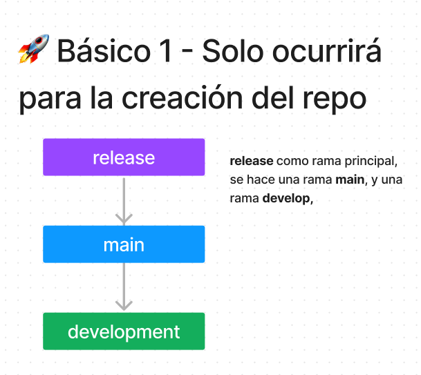
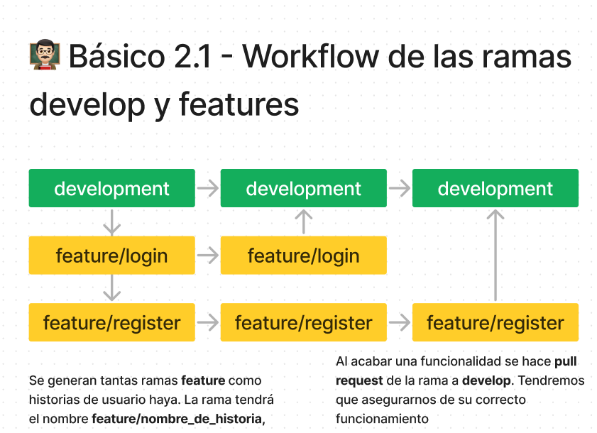
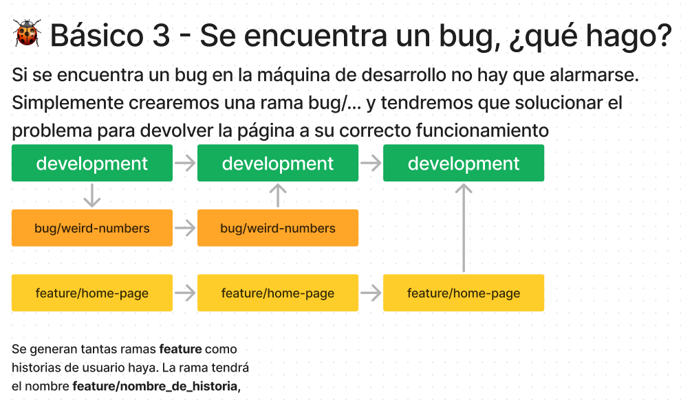
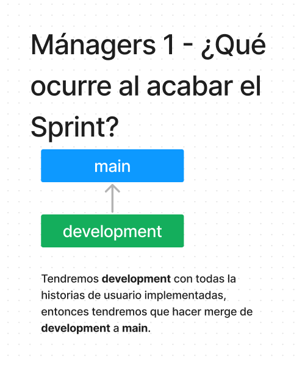
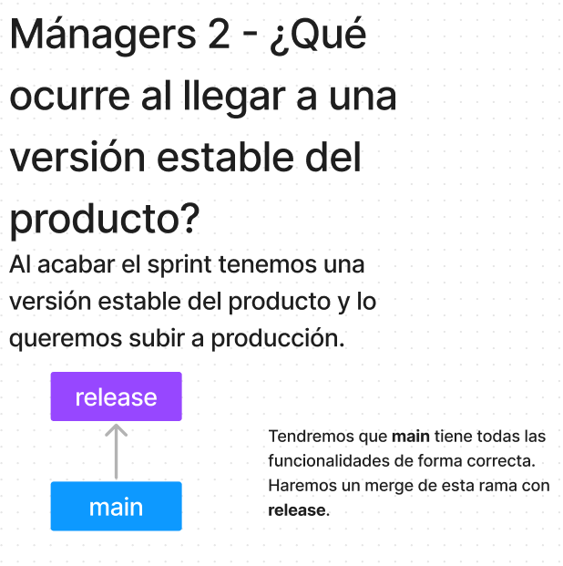
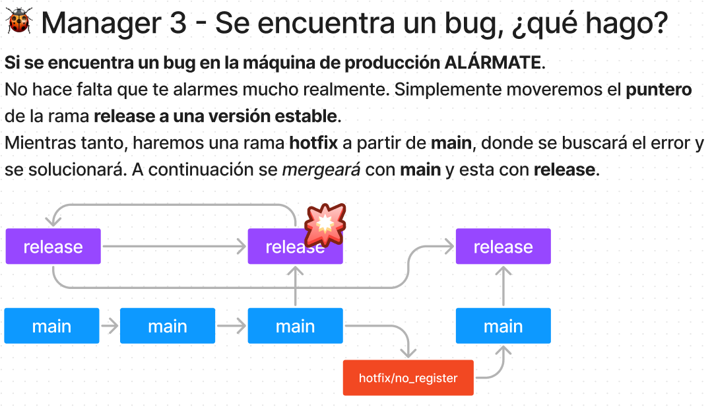
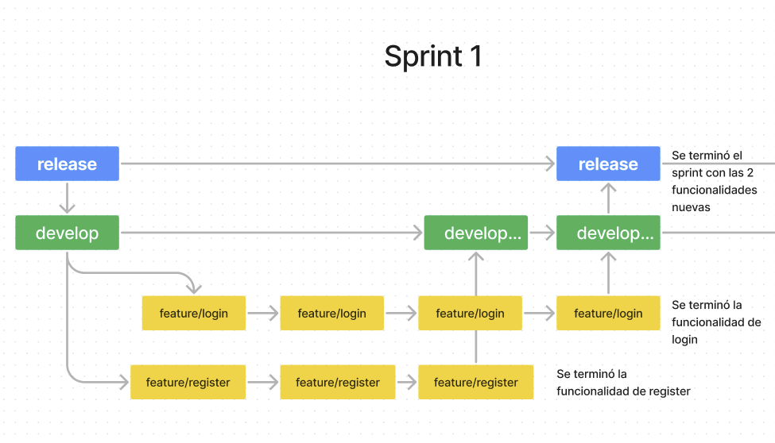
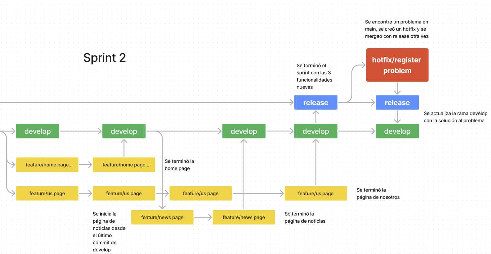
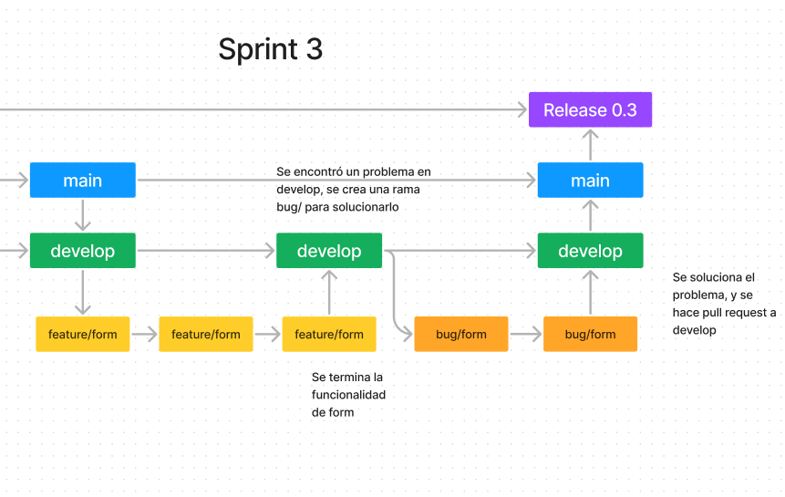
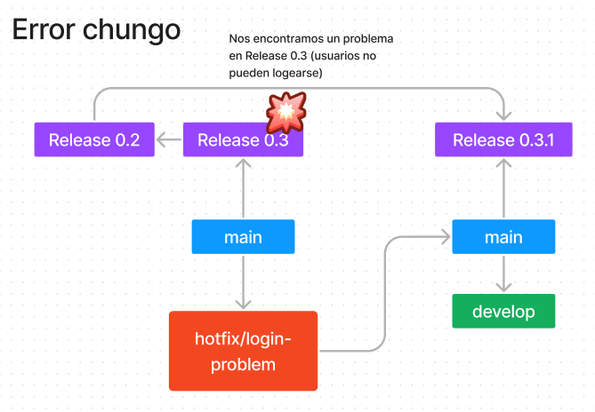

Autores:
    - Jose Manuel Illera Rodríguez(@Illera1999)
    - Cristobal José Jiménez Gómez (@Cristobaljjg)

# La guía del Git poderoso 💪🏼

Bienvenido a la guía que nunca hará merge con tus emociones, pero que si hablará sobre Git y más en concreto de nuestro Git Workflow.

Por si acaso lleves toda tu vida en una cueva, Git es como la opción de "Guardar" de un videojuego para los desarrolladores de software: puedes guardar, borrar y cargar partida todo lo que quieras, pero si no tienes cuidado, puedes terminar volviendo a empezar de cero una misión o incluso la partida por no llevar un orden.

Siempre hay que tener cuidado con git, **¡Así que asegúrate de hacer commits temprano y a menudo, mantén un historial limpio y ordenado, y siempre recuerda hacer push antes de irte de casa!**

# Índice
1. [¿Qué es Git Workflow?](#¿qué-es-git-workflow)
2. [Nuestro Git Workflow](#nuestro-git-workflow)
3. [Pequeños ejemplos de ilustración](#pequeños-ejemplo-de-funcionamiento-ilustrado)

 

# ¿Qué es Git Workflow?

Para que se hagan una idea, un git workflow es un conjunto de prácticas y procesos que implementa en un proyecto utilizando el sistema de control Git.

# Nuestro Git Workflow

En esta guía se da por hecho que se manejan a nivel principiante en git y si por algún casual no es así pueden mirar este [enlace de referencia](https://git-scm.com/docs).

Tendremos 6 tipos de ramas:

**develop**: Se utiliza como **rama de desarrollo**, la cual tendrá los cambios implementados en cada sprint.
* Al principio de un sprint se hará un **merge** desde **main**.
* Se irán introduciendo los pequeños cambios de las ramas de *features*, hasta que todas las historias estén completadas.
* Cuando se completen todas las historias del sprint, se hará un **merge** de esta rama a **main**.

**features**: Se hará una rama feature por cada historia de usuario u objetivo.
* Se crearán las ramas a partir del último *commit* de **develop**.
* Se harán tantos *commits* como sean necesarios hasta completar el sprint.
* Una vez completada la funcionalidad o historia, se verificará su correcto funcionamiento.
* Si todo está correcto, se hará un ***pull request*** hacia **develop**.

**release**: Se utiliza como **rama oficial de producción**. Tendremos que procurar que **SIEMPRE** esté bien, ya que será la página donde podrá entrar la gente.
* El **equipo de Management** será el encargado de esta rama, y serán las **únicas personas** que podrán **hacer y deshacer *merges*** de esta.
* Aquí **únicamente** entrarán los cambios desde la rama de **main** tras conseguir una versión estable del producto.
* En caso de encontrar algún fallo en **release**, tendremos que:
  * Llevar esta rama a una versión estable y modificar main.
  * Cuando exista una nueva versión estable se hará un nuevo merge desde **main** a **release**.

**main**: Se utiliza como **rama donde guardar los cambios tras cada sprint**.
* El **equipo de Management** serán los encargados de esta rama.
* Tendrán que realizar un *merge* al final de cada sprint con todos los cambios.
* En caso de encontrar algún fallo en **release**, tendremos que:
  * Hacer una rama hotfix que parte de **main**.
  * Arreglar el problema y testear que el problema está solucionado.
  * Hacer un merge a **main** con el problema resuelto.
  * Y por último, hacer un merge de **main** a **release**.

**bugs:** Se utiliza como **rama para *fixear* bugs dentro de develop**.  
* En caso de encontrar algún bug durante un sprint se tendrá que:
  * Crear una rama nueva a partir de **develop**.
  * Se arreglará el bug y se hará un nuevo **_pull request_** a develop.

**hotfix** (Esperemos crear el menor nº posible de estas): Se utilizan para **cambios rápidos de release en main**.
* Se hará una rama de hotfix para solucionar el problema que parta de main.
* Se solucionará lo más rápido posible.
* Se hará **merge/pull request** a **main** con los cambios ya hechos.
* A continuación, habrá que hacer un merge de **main** a **release**.

# Pequeños ejemplo de funcionamiento ilustrado
[Sitio donde se encuentran los esquemas](https://www.figma.com/file/3s2bq7QCris0rxbC4yHke9/GitFlow-Explaining?node-id=0%3A1&t=1Tb45vD5aazSZJzJ-1)
## Cosas que solo courrirán 1 vez

## Workflow de las ramas Develop y features

## Se encuentra un bug en develop

## ¿Qué hacer cuando acaba un sprint?

## LLegamos a una versión estable, ¿Qué hacemos?

## Se encuentra un bug en Release, ¿Qué hacemos? ☠️

## Ejemplo completo con distintos casos
En mi opinión, esto sí sería mejor verlo directamente dentro de Figma ([Enlace](https://www.figma.com/file/3s2bq7QCris0rxbC4yHke9/GitFlow-Explaining?node-id=0%3A1&t=1Tb45vD5aazSZJzJ-1)), ya que es un transcurso.

